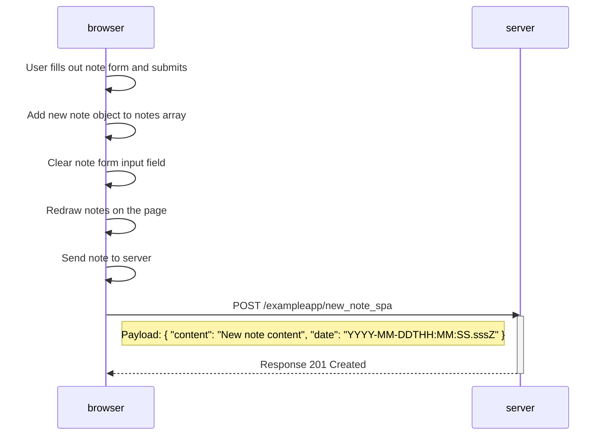

```mermaid
sequenceDiagram
    participant browser
    participant server

    browser->>browser: User fills out note form and submits

    browser->>browser: Add new note object to notes array
    browser->>browser: Clear note form input field
    browser->>browser: Redraw notes on the page
    browser->>browser: Send note to server

    browser->>server: POST /exampleapp/new_note_spa
    activate server
    Note right of browser: Payload: { "content": "New note content", "date": "YYYY-MM-DDTHH:MM:SS.sssZ" }
    server-->>browser: Response 201 Created
    deactivate server

```